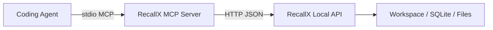

# RecallX — MCP Bridge

## At A Glance

- RecallX ships a stdio MCP bridge for coding agents that want tool discovery instead of raw HTTP prompts.
- The MCP bridge is an adapter over the existing local HTTP API, not a second storage or runtime layer.
- The current recommended transport is stdio only.
- MCP writes remain provenance-aware because all durable operations still flow through the local RecallX API.

## 1. Goal

RecallX's durable product surface remains:
- local HTTP API
- local CLI
- renderer UI

The MCP server is an adapter layer for coding agents that prefer tool discovery and structured tool calls over raw HTTP prompts.

v1 MCP scope is intentionally narrow:
- stdio transport only
- tools first
- no separate storage layer
- all tool calls proxy the already-running local RecallX HTTP API

This keeps RecallX's real contract in one place while making Claude Code, Codex, and similar tools easier to wire up.

---

## 2. Transport

### v1 recommendation
- stdio only

### Why
- best fit for local process-spawned integrations
- simplest setup for coding tools
- no second network listener to manage
- keeps MCP as a thin bridge, not a competing runtime

Entrypoints:

```bash
npm run mcp
npm run dev:mcp
node dist/server/app/mcp/index.js --api http://127.0.0.1:8787/api/v1
```

Environment:

- `RECALLX_API_URL` — target RecallX HTTP API base URL
- `RECALLX_API_TOKEN` — optional bearer token for auth-enabled local services
- `RECALLX_MCP_SOURCE_LABEL` — default provenance label for writes
- `RECALLX_MCP_TOOL_NAME` — default provenance tool name for writes

---

## 3. Architecture



Rules:
- the MCP server never mutates storage directly
- every durable write still flows through the existing HTTP governance layer
- bearer auth stays enforced by the HTTP API if enabled
- MCP defaults a provenance source when the caller does not provide one

---

## 4. First-pass tool surface

| Tool | Purpose | HTTP mapping |
| --- | --- | --- |
| `recallx_health` | Check local API health | `GET /health` |
| `recallx_workspace_current` | Read current workspace | `GET /workspace` |
| `recallx_workspace_list` | List known workspaces | `GET /workspaces` |
| `recallx_workspace_create` | Create and switch workspace | `POST /workspaces` |
| `recallx_workspace_open` | Switch to existing workspace | `POST /workspaces/open` |
| `recallx_semantic_status` | Read semantic index status and queue counts | `GET /semantic/status` |
| `recallx_semantic_issues` | Read semantic issue details with optional status filters and cursor pagination | `GET /semantic/issues` |
| `recallx_capture_memory` | Safely capture memory without choosing node vs activity first | `POST /capture` |
| `recallx_search_nodes` | Search durable nodes with filters | `POST /nodes/search` |
| `recallx_search_activities` | Search activity timeline events | `POST /activities/search` |
| `recallx_search_workspace` | Search nodes and activities together | `POST /search` |
| `recallx_get_node` | Read node detail bundle | `GET /nodes/:id` |
| `recallx_get_related` | Read canonical plus inferred neighborhood items | `GET /nodes/:id/neighborhood` |
| `recallx_upsert_inferred_relation` | Upsert inferred relation | `POST /inferred-relations` |
| `recallx_append_relation_usage_event` | Append relation usage signal | `POST /relation-usage-events` |
| `recallx_append_search_feedback` | Append usefulness feedback for search results | `POST /search-feedback-events` |
| `recallx_recompute_inferred_relations` | Recompute inferred relation scores | `POST /inferred-relations/recompute` |
| `recallx_append_activity` | Append node activity | `POST /activities` |
| `recallx_create_node` | Create durable node | `POST /nodes` |
| `recallx_create_nodes` | Create multiple durable nodes with partial success | `POST /nodes/batch` |
| `recallx_create_relation` | Create relation | `POST /relations` |
| `recallx_list_governance_issues` | Read surfaced contested or low-confidence entities | `GET /governance/issues` |
| `recallx_get_governance_state` | Read governance state for one entity | `GET /governance/state/:entityType/:id` |
| `recallx_recompute_governance` | Recompute bounded governance state | `POST /governance/recompute` |
| `recallx_context_bundle` | Build compact agent context | `POST /context/bundles` |
| `recallx_rank_candidates` | Rank candidate nodes with relation and semantic request-time signals | `POST /retrieval/rank-candidates` |
| `recallx_semantic_reindex` | Queue workspace semantic reindex | `POST /semantic/reindex` |
| `recallx_semantic_reindex_node` | Queue semantic reindex for one node | `POST /semantic/reindex/:nodeId` |

### Tool design notes

- Read tools are marked read-only/idempotent where possible.
- Durable write tools accept an optional `source` object.
- If `source` is omitted, the MCP bridge fills in its own default agent provenance.
- `recallx_capture_memory` is the preferred first write for LLMs only before a project or target node is known. Once work is clearly attached to a project, include `targetNodeId` on capture writes or switch to `recallx_append_activity` for routine summaries.
- We do not expose low-level retrieval fragments or settings mutation in the first pass.
- `recallx_get_related` defaults to including inferred relations because that is the most useful shape for downstream LLMs; agents can disable inferred items when they specifically need only canonical links.
- Usage feedback is intentionally a separate write. Do not append a relation usage event for every read; reserve it for cases where a canonical or inferred relation actually helped retrieval or final output.
- Score recomputation is also explicit. Use `recallx_recompute_inferred_relations` in maintenance flows or automations, not in the latency-sensitive request path.
- The search tools normalize common alias mistakes such as `type`, `activityType`, `targetNodeId`, `scope`, and single-string arrays before forwarding to HTTP.
- For `recallx_search_workspace`, prefer `scopes: ["nodes", "activities"]` for mixed search, or `scope: "activities"` for a single scope. Do not send `"nodes,activities"` as one string.
- When you do not already know the target node, prefer `recallx_search_workspace` as the default entry point. Use `recallx_search_nodes` for durable-only narrowing and `recallx_search_activities` for recent operational narrowing.

### Workspace vs project

- `workspace` is the top-level storage container and the default MCP working scope.
- Do not switch workspaces unless the user explicitly asks for it.
- `project` is a node type stored inside the current workspace.
- Create or reuse a project only when the task is clearly project-shaped, such as ongoing repo work, a named app, or a named CLI.
- If the conversation is not project-specific, keep memory at workspace scope.

### When to use each search tool

- Use `recallx_search_workspace` as the broad default when the request shape is still unclear or when you want both node and activity recall.
- Use `recallx_search_nodes` when you want durable-only recall, especially when checking whether a project already exists with `type=project`.
- Use `recallx_search_activities` when you want recent logs, change history, or "what happened recently" answers.

### Project initialization with existing tools only

When the work is clearly project-shaped, keep the flow inside the current workspace:

1. Read `recallx_workspace_current` to confirm the active workspace.
2. Search for an existing project with `recallx_search_nodes` and `type=project`.
3. If you need broader context before deciding, widen the search with `recallx_search_workspace`.
4. Create a new project with `recallx_create_node` and `type=project` only when no suitable project already exists.
5. Once the project is known, use `recallx_context_bundle` with `targetId` to anchor follow-up context.
6. After the project is known, do not keep writing untargeted workspace captures for routine project logs. Use `recallx_append_activity` or `recallx_capture_memory` with `targetNodeId`.
7. If the work is not tied to a specific project yet, omit `targetId` and use the workspace-entry bundle instead.

---

## 5. Input schema conventions

### Durable writes

```json
{
  "source": {
    "actorType": "agent",
    "actorLabel": "Claude Code",
    "toolName": "claude-code",
    "toolVersion": "1.0.0"
  }
}
```

The `source` block is optional at the MCP layer but always present by the time the request reaches the RecallX API.

### Capture writes

Use `recallx_capture_memory` when you want the server to choose between activity and durable storage:

```json
{
  "mode": "auto",
  "body": "Finished the MCP validation fix and updated the tests."
}
```

The server routes short log-like agent updates to the workspace inbox activity timeline and keeps reusable or decision-shaped content as durable nodes. Treat that inbox routing as a fallback for untargeted work, not as the default place for ongoing project logs once a project node is known.

### Context bundle target

The MCP tool simplifies the HTTP payload:

```json
{
  "mode": "compact",
  "preset": "for-coding"
}
```

Add `targetId` when you already know the node you want to anchor on:

```json
{
  "targetId": "node_...",
  "mode": "compact",
  "preset": "for-coding"
}
```

When `targetId` is omitted, the bridge requests a workspace-entry bundle instead of a node-anchored bundle.

### Write landing metadata

`recallx_create_node`, `recallx_create_relation`, and `recallx_capture_memory` now return a `landing` object that explains where the write landed under automatic governance:

- `storedAs`
- `canonicality` when applicable
- `status`
- `governanceState`
- `reason`

`recallx_create_nodes` returns the same `landing` shape on each successful item and preserves item-level errors for partial-success batches.

### Search defaults

When starting a task without a known node id, prefer mixed search first:

```json
{
  "query": "cleanup governance migration",
  "sort": "smart"
}
```

`recallx_search_workspace` keeps both node and activity recall in play, while `recallx_search_nodes` and `recallx_search_activities` are better used as follow-up narrowing tools.

Empty-query browse is explicit at the MCP layer:

```json
{
  "allowEmptyQuery": true,
  "sort": "updated_at"
}
```

### Governance reads

`recallx_recompute_governance` accepts:
- optional `entityType`
- optional bounded `entityIds`
- optional `limit`

This keeps governance maintenance explicit without reintroducing a human review queue.

---

## 6. Why tools first

Resources and prompts are useful, but tools are the highest-value first step because RecallX is primarily an action-oriented local knowledge service:
- search
- inspect
- create
- relate
- inspect governance
- bundle

Future additions can include:
- `recallx://service-index`
- `recallx://workspace/current`
- reusable prompts for "capture note", "inspect governance issues", and "build coding context"

---

## 7. Suggested agent configuration

Example command:

```text
node /absolute/path/to/RecallX/dist/server/app/mcp/index.js
```

Suggested environment:

```text
RECALLX_API_URL=http://127.0.0.1:8787/api/v1
RECALLX_API_TOKEN=<optional>
```

Operational expectation:
- reuse the existing running RecallX service
- do not start a second API instance unless the configured one is unavailable
- prefer `recallx_workspace_current` and `recallx_search_workspace` before creating new data
- pass `RECALLX_API_TOKEN` directly to the MCP process when bearer auth is enabled; do not rely on renderer/browser token storage

Codex / JetBrains MCP JSON example:

```json
{
  "mcpServers": {
    "recallx": {
      "command": "/Users/yourname/.recallx/bin/recallx-mcp",
      "args": []
    }
  }
}
```

Notes:
- Use `recallx` as the server key in Codex MCP configs unless your client requires a different local alias.
- JetBrains expects the top-level `mcpServers` wrapper.
- Prefer the stable launcher path over a bare `RecallX` command because GUI apps do not always inherit your shell `PATH`.
- If the launcher script points at a packaged `RecallX.app`, open the app at least once first so the launcher is created.

---

## 8. Active LLM usage playbook

Connecting RecallX over MCP is not enough by itself. The best results come when the agent is explicitly told to use RecallX early and throughout the task.

### Default operating loop for coding agents

1. Confirm the current workspace with `recallx_workspace_current`.
2. If the target is still unclear, start broad with `recallx_search_workspace`.
3. If the work is clearly project-shaped, search for an existing project with `recallx_search_nodes` and `type=project`.
4. Once the relevant node or project is known, build a compact `recallx_context_bundle`.
5. Do the real task.
6. Write back a concise result with `recallx_append_activity` or targeted `recallx_capture_memory`.

### Behaviors worth encouraging in the agent prompt

- read context before making assumptions
- prefer `recallx_search_workspace` over blind browsing when the target is still unclear
- reuse existing project nodes instead of creating duplicates
- keep routine logs attached to the project once one is known
- prefer compact bundles over repeated wide searches
- write back a concise summary after meaningful work

### Copy-paste MCP instruction

Use this when configuring another LLM or coding agent:

```text
Use RecallX through MCP as an active local memory layer during this task, not just for final write-back.
Treat the current workspace as the default scope and do not switch workspaces unless I explicitly ask.
Before making assumptions or starting meaningful work, read context first:
- call recallx_workspace_current
- use recallx_search_workspace when the target is still unclear
- if the task is clearly project-shaped, search for an existing project with recallx_search_nodes and type=project
- once the relevant node or project is known, build a compact recallx_context_bundle
Prefer compact context over repeated broad browsing.
Once a project is known, append routine work logs to that project instead of writing untargeted workspace captures.
After meaningful work, write back a concise summary of what changed, what was verified, and any follow-up.
```

### Anti-patterns

Avoid prompting the agent in ways that cause these behaviors:

- only using RecallX for final logging
- creating a new project node before checking whether one already exists
- staying at workspace scope after a project node is already known
- repeatedly searching broadly instead of anchoring on a known node with a context bundle
- switching workspaces during a task without an explicit user request
