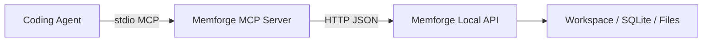

# Memforge — MCP Bridge

## 1. Goal

Memforge's durable product surface remains:
- local HTTP API
- local CLI
- renderer UI

The MCP server is an adapter layer for coding agents that prefer tool discovery and structured tool calls over raw HTTP prompts.

v1 MCP scope is intentionally narrow:
- stdio transport only
- tools first
- no separate storage layer
- all tool calls proxy the already-running local Memforge HTTP API

This keeps Memforge's real contract in one place while making Claude Code, Codex, and similar tools easier to wire up.

---

## 2. Transport

### v1 recommendation
- stdio only

### Why
- best fit for local process-spawned integrations
- simplest setup for coding tools
- no second network listener to manage
- keeps MCP as a thin bridge, not a competing runtime

Entrypoints:

```bash
npm run mcp
npm run dev:mcp
node dist/server/app/mcp/index.js --api http://127.0.0.1:8787/api/v1
```

Environment:

- `MEMFORGE_API_URL` — target Memforge HTTP API base URL
- `MEMFORGE_API_TOKEN` — optional bearer token for auth-enabled local services
- `MEMFORGE_MCP_SOURCE_LABEL` — default provenance label for writes
- `MEMFORGE_MCP_TOOL_NAME` — default provenance tool name for writes

---

## 3. Architecture



Rules:
- the MCP server never mutates storage directly
- every durable write still flows through the existing HTTP governance layer
- bearer auth stays enforced by the HTTP API if enabled
- MCP defaults a provenance source when the caller does not provide one

---

## 4. First-pass tool surface

| Tool | Purpose | HTTP mapping |
| --- | --- | --- |
| `memforge_health` | Check local API health | `GET /health` |
| `memforge_workspace_current` | Read current workspace | `GET /workspace` |
| `memforge_workspace_list` | List known workspaces | `GET /workspaces` |
| `memforge_workspace_create` | Create and switch workspace | `POST /workspaces` |
| `memforge_workspace_open` | Switch to existing workspace | `POST /workspaces/open` |
| `memforge_search_nodes` | Search nodes with filters | `POST /nodes/search` |
| `memforge_get_node` | Read node detail bundle | `GET /nodes/:id` |
| `memforge_get_related` | Read related nodes | `GET /nodes/:id/related` |
| `memforge_append_activity` | Append node activity | `POST /activities` |
| `memforge_create_node` | Create durable node | `POST /nodes` |
| `memforge_create_relation` | Create relation | `POST /relations` |
| `memforge_review_list` | Read review queue | `GET /review-queue` |
| `memforge_review_get` | Read one review item | `GET /review-queue/:id` |
| `memforge_review_decide` | Approve / reject / edit-and-approve | `POST /review-queue/:id/:action` |
| `memforge_context_bundle` | Build compact agent context | `POST /context/bundles` |

### Tool design notes

- Read tools are marked read-only/idempotent where possible.
- Durable write tools accept an optional `source` object.
- If `source` is omitted, the MCP bridge fills in its own default agent provenance.
- We do not expose low-level retrieval fragments or settings mutation in the first pass.

---

## 5. Input schema conventions

### Durable writes

```json
{
  "source": {
    "actorType": "agent",
    "actorLabel": "Claude Code",
    "toolName": "claude-code",
    "toolVersion": "1.0.0"
  }
}
```

The `source` block is optional at the MCP layer but always present by the time the request reaches the Memforge API.

### Context bundle target

The MCP tool simplifies the HTTP payload:

```json
{
  "targetId": "node_...",
  "mode": "compact",
  "preset": "for-coding"
}
```

The bridge expands that to the API's `target: { type, id }` shape.

### Review decisions

`memforge_review_decide` accepts:
- `action`: `approve` | `reject` | `edit-and-approve`
- `notes`
- optional `patch`
- optional `source`

This collapses three HTTP endpoints into one MCP tool because the action is part of the natural agent intent.

---

## 6. Why tools first

Resources and prompts are useful, but tools are the highest-value first step because Memforge is primarily an action-oriented local knowledge service:
- search
- inspect
- create
- relate
- review
- bundle

Future additions can include:
- `memforge://service-index`
- `memforge://workspace/current`
- reusable prompts for "capture note", "triage review queue", and "build coding context"

---

## 7. Suggested agent configuration

Example command:

```text
node /absolute/path/to/Memforge/dist/server/app/mcp/index.js
```

Suggested environment:

```text
MEMFORGE_API_URL=http://127.0.0.1:8787/api/v1
MEMFORGE_API_TOKEN=<optional>
```

Operational expectation:
- reuse the existing running Memforge service
- do not start a second API instance unless the configured one is unavailable
- prefer `memforge_workspace_current` and `memforge_search_nodes` before creating new data
